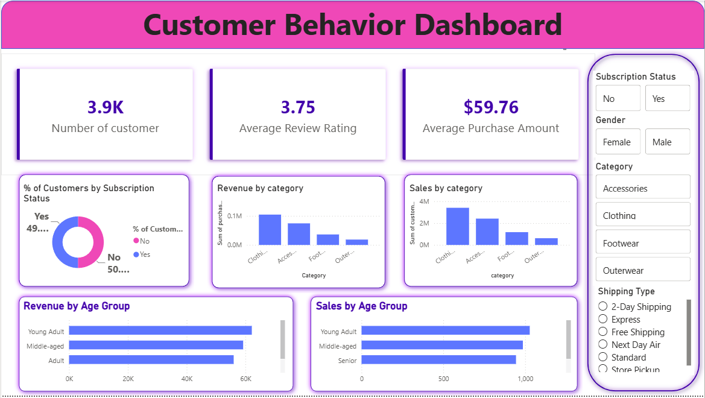

# 🛍️ Customer Shopping Behavior Analysis

An end-to-end Data Analytics project that analyzes customer shopping behavior using **Python, PostgreSQL, SQL, and Power BI**. The project focuses on cleaning raw data, performing business analysis, and building an interactive dashboard to uncover meaningful insights for better business decision-making.

---

## 📌 Project Overview

Understanding customer purchasing behavior is one of the most important aspects of modern retail businesses. This project demonstrates a complete data analytics workflow, starting from raw customer data and ending with interactive business dashboards.

The dataset was cleaned and analyzed using Python, stored in PostgreSQL, queried using SQL, and visualized through Power BI to identify customer trends, sales performance, purchasing patterns, and business opportunities.

---

## 🎯 Objectives

- Clean and preprocess raw customer shopping data.
- Perform Exploratory Data Analysis (EDA).
- Store the dataset in PostgreSQL.
- Analyze business problems using SQL queries.
- Build an interactive Power BI dashboard.
- Generate actionable business insights and recommendations.

---

## 🛠️ Tech Stack

| Technology | Purpose |
|------------|---------|
| Python | Data Cleaning & Preprocessing |
| Pandas | Data Manipulation |
| NumPy | Numerical Operations |
| Jupyter Notebook | Development Environment |
| PostgreSQL | Database Management |
| SQL | Business Analysis |
| Power BI | Data Visualization & Dashboard |

---

## 📂 Project Structure

```
Customer-Shopping-Behavior-Analysis/
│
├── Dataset/
│   └── customer_shopping_data.csv
│
├── Python/
│   └── Customer_Shopping_Analysis.ipynb
│
├── SQL/
│   └── customer_analysis.sql
│
├── PowerBI/
│   └── Customer_Shopping_Dashboard.pbix
│
├── Images/
│   └── Dashboard.png
│
├── Report/
│   └── Customer_Shopping_Behavior_Analysis.pdf
│
└── README.md
```

---

## 🔄 Project Workflow

```
Raw Dataset
      │
      ▼
Data Cleaning (Python)
      │
      ▼
Exploratory Data Analysis
      │
      ▼
PostgreSQL Database
      │
      ▼
SQL Business Queries
      │
      ▼
Power BI Dashboard
      │
      ▼
Business Insights
```

---

## 📊 Dashboard Highlights

The interactive dashboard includes:

- Customer Overview
- Revenue by Category
- Revenue by Age Group
- Sales by Product Category
- Sales by Age Group
- Subscription Analysis
- Customer Review Ratings
- Gender-wise Revenue Analysis
- Interactive Filters

---

## 📈 SQL Analysis Performed

- Revenue by Age Group
- Revenue by Gender
- Top Purchased Product Categories
- Average Purchase Amount by Shipping Type
- Customer Purchase Trends
- Category-wise Sales Analysis

---

## 💡 Key Business Insights

- Male customers contributed significantly more revenue than female customers.
- Young Adult customers generated the highest revenue among all age groups.
- Clothing and Electronics emerged as the highest-selling product categories.
- Express Shipping showed a higher average purchase value than Standard Shipping.
- Subscription customers demonstrated higher purchasing activity compared to non-subscribers.

---

## 🚀 Skills Demonstrated

- Data Cleaning
- Data Wrangling
- Exploratory Data Analysis (EDA)
- SQL Query Writing
- Database Management
- Business Intelligence
- Dashboard Development
- Data Visualization
- Business Analytics
- Insight Generation

---


## 📷 Project Preview

### Power BI Dashboard



---

## 📚 Future Improvements

- Customer Segmentation using Machine Learning
- Customer Churn Prediction
- Sales Forecasting
- Product Recommendation System
- Real-time Dashboard Integration
- Predictive Analytics

---

## 👨‍💻 Author

**Amritanshu Pandey**

Integrated M.Sc. Mathematics  
Sardar Vallabhbhai National Institute of Technology (SVNIT), Surat

GitHub: https://github.com/amritanshupan20

---

## ⭐ If you found this project useful, consider giving it a Star!
